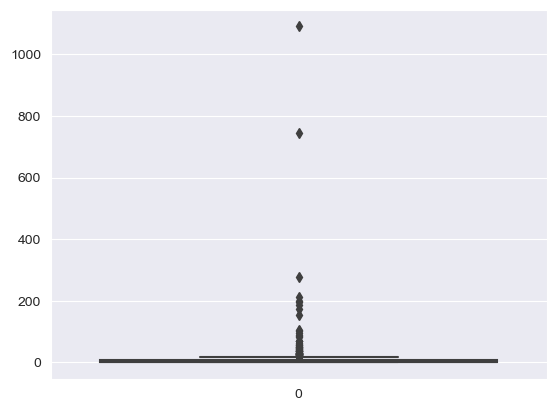
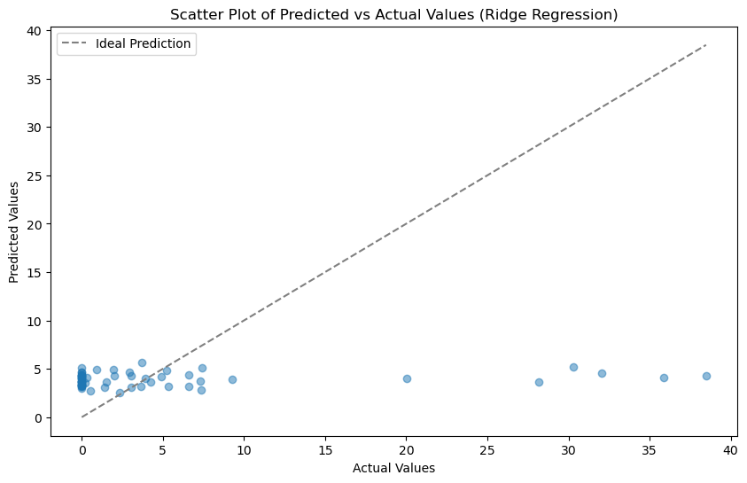

# Burned Areas by Forest Fires Modeling

# 1. Data
The current project aims to model a projection of the burned area by forest fires in a northeast area in Portugal using metereological and environmental data provided by the following source: https://archive.ics.uci.edu/dataset/162/forest+fires

# 2. Method
Our main goal was to predict the burned area by forest fires while using Linear Regression to model the data set. 

# 3. Cleaning and Data Wrangling
The first step we needed to take was to verify that our data did not have any null values. Secondly we needed to drop columns that were not deemed useful for our analysis such as the "day" column which could create too much noise for our modeling.

We however decided to keep the "month" column to take into account seasonality. We then converted the categorical variable into indicator variables to be able to analyse this seasonality into our model.

# 4. EDA
One interesting fact about our data is that our target demonstrates great ammounts of 0.0 values creating a big ammount of outliers. 

()

As we can still pre process the data we decided to take a further look into potential correlations between the variables. We could find that area had a greater positive correlation to area burned than the other variables.

# 5. Pre Processing
After the further analysis of the data we decide to deal with the outliers problem running a z-score of each variable and testing the threasholds to eliminate the outliers we ran that for each column we would like to use while also keeping some numbers of outliers so some columns wouldn't become too small.

We then dropped some columns like "month_numerical", "months", "X" and "Y" that could create too much noise for our modeling.

# 6. Modeling
Finally we being our Machine Learning modeling. While utilizing the Linear Regression we also decide to use Standard Scaling as our variables each possess different metrics for their measuring. However upon reviewing our R squared of 0.05588399328978311 and Mean Squared Error of 81.56626421961893 we decided to look more into what kind of predictions it gave.

We then raise the hypothesis of the data set having perhaps too much noise so we try to run our modeling with less variables that demonstrated stronger correlations with the target variable. However the R squared score seemed to be diminishe: 0.017138344812520967. As we observe these results together with the visual representation we get to understand that the linear regression model may be unfit for the prediction of the area burned by forest fires and the variables may have non linear correlations between each other and with the target variable.

# 7. Further Improvements and Research

We currently seem to be dealing with a complex data set that can observe other types of moduling and Machine Learning methods. We will be looking for further ways to improve the R squared score and be research about new upcoming methodologies that can deal with metereological data with more accuracy.

# 8. Credits
Thank you to the developers of the sci-kit learn pacakage and pandas. Thank you for the data analyst and developer Sabrina Santana for working in this project with me. Thank you The Knowledge House for all the knowledge given to the completion of this project.